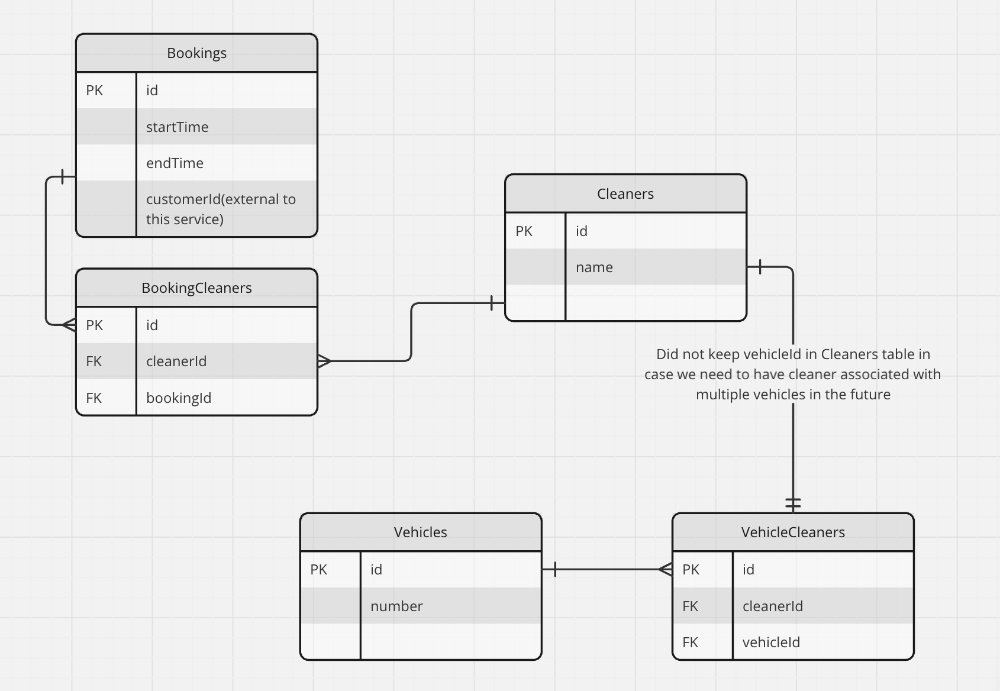

# Booking Service

### This project deals with appointments listing and booking of cleaning services for customers

### Technologies used and purpose
* Java 21
* Spring Boot
* Gradle for dependency management
* Postgres as database
* Liquibase for migration and to create  25 cleaners and 5 vehicles, their associations
* Testcontainers for integration testing
* Swagger for auto generated documentation
* Docker compose to setup database locally

### Database schema


### Running the application
* Start a PostgreSQL instance using Docker:
```
docker-compose -f docker-compose.yml up
```

* Type the following command(You can also just run from IntelliJ IDEA by clicking on the application run button)
```
./gradlew bootRun
```

* The application will be running on http://localhost:8080
* Click [here](http://localhost:8080/index.html)
  to access the API documentation after starting the application

